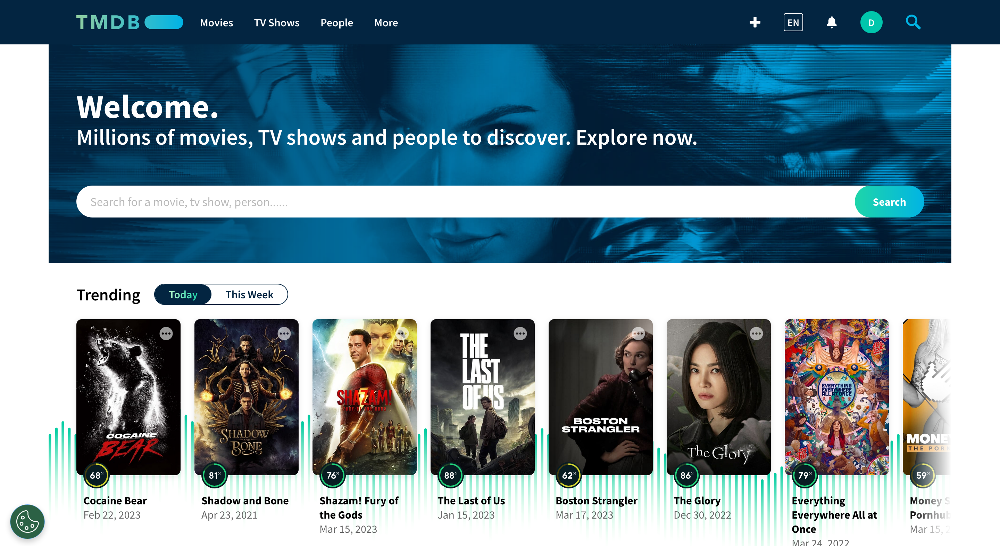

```{r setup, include=FALSE}
knitr::opts_chunk$set(echo = FALSE)
```

```{r code, include=FALSE}
library(httr2)
library(tidyverse)
library(purrr)
library(jsonlite)
library(xml2)
library(magrittr)
library(plotly)
library(lattice)
library(webshot)
library(tmdbR)
set_api_tmdb("../../token.txt")
```

```{r source, include=FALSE}
library(knitr)
source("dh_tmdb_presentation_code.R", local = knitr::knit_global())
```


## Index

-   The Movie DataBase

-   Library `tmdbR`

-   Data visualization

-   Limitations

---


## The Movie DataBase

-   Extract information on top 20 daily and weekly movies and series

-   Extract media content's genre and recode it into categories



---

## **`library(tmdbR)`**

```{r library, message=FALSE}
remotes::install_github("myanesp/tmdbR")
```

-   Package with 22 functions
-   We will be adding more features to the package

|                                                                          |
|------------------------|---------------------|---------------------------|
| get_top_rated_movies() | get_trending_day()  | get_upcoming()            |
| get_top_rated_tv()     | get_trending_week() | get_in_cinemas()          |
| get_streaming_df()     | get_details()       | get_streaming_providers() |
| transform_genres()     | add_details()       | search_tmdb()             |

---
## Data visualization

```{r dataviz4, echo=FALSE,out.width='100%', fig.height=6,}
series
```


---
## Data visualization

```{r echo=FALSE, out.width='100%', fig.height=6,}
bubble_chart
```

---

## Streaming providers

```{r fig.height=6, fig.width=8, message=FALSE, warning=FALSE}
get_streaming_providers(804150, "movie", "US")
get_streaming_providers(238, "movie", "US")
get_streaming_providers(238, "movie", "ES")
search_tmdb("encanto")
```


---

## **`add_details()`**

```{r message=FALSE, warning=FALSE, include=FALSE}
rev_budget <- top_rated_movies %>% 
  add_detail(c("revenue", "budget")) %>% 
  select(title, revenue, budget)

```

```{r message=FALSE, warning=FALSE}
get_details(545611, "movie", "budget")
head(rev_budget)
```

---

## Limitations

- Selenium
    Our intention was to obtain the top rated movies filtering by year of their release.
    Unfortunately, we couldn't achieve it... but the code is written!
    
- Some functions of the package need to be more complete (like `add_detail()`)
